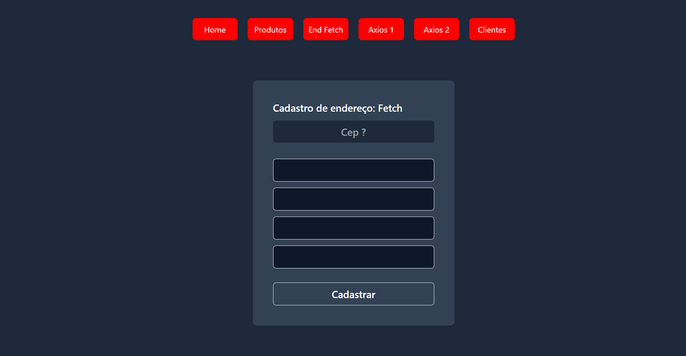

> ### Next Fetch Vs Axios

#### Pages




#### Crud Json

* rodando api
```
npx json-server db.json  --port 8080
```

npm i @react-input/mask

npm i react-toastify

npm i axios

https://www.npmjs.com/package/@react-input/mask

> #### ref.
https://www.youtube.com/watch?v=e6FigV2fLC8&t=3082s